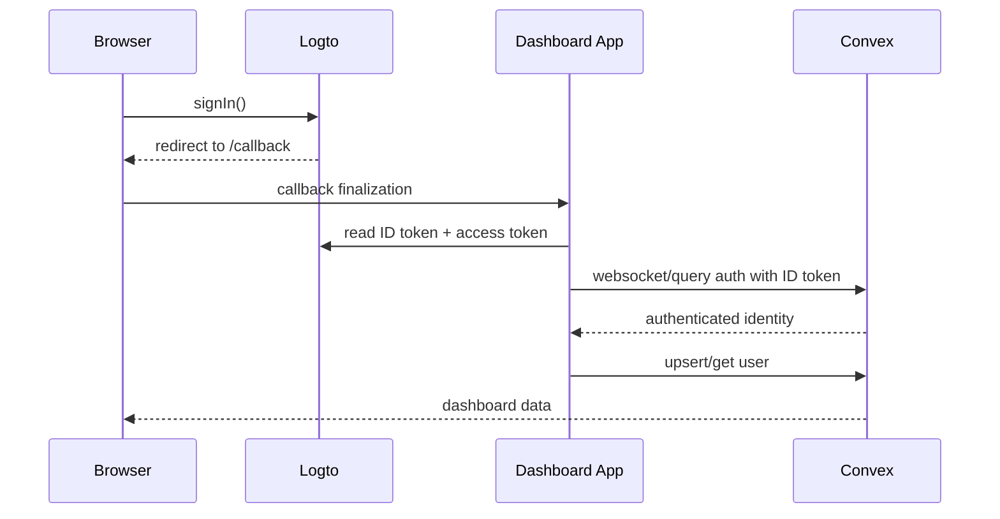
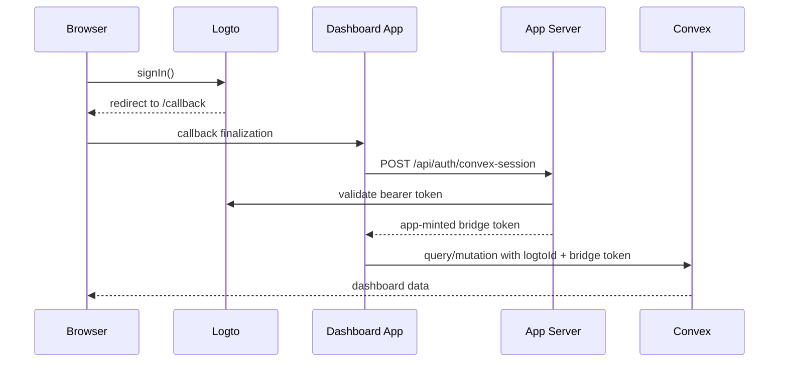

# Dashboard-v2 Auth Runbook

## Current Modes

- `AUTH_BRIDGE_MODE=legacy`: browser Logto auth plus app-minted Convex bridge token
- `AUTH_BRIDGE_MODE=native`: browser Logto auth plus native Convex custom auth via `convex/auth.config.ts`

## Required Self-Hosted Settings

### App container

- `AUTH_BRIDGE_MODE`
- `VITE_AUTH_BRIDGE_MODE`
- `LOGTO_ENDPOINT`
- `VITE_LOGTO_ENDPOINT`
- `VITE_LOGTO_APP_ID`
- `VITE_LOGTO_REDIRECT_URI`
- `VITE_LOGTO_SCOPES`
- `VITE_CONVEX_URL`

### Convex deployment

- `LOGTO_ENDPOINT`
- `LOGTO_APP_ID`

## Flow Diagrams

### Native Sign-In

### Legacy Sign-In

## Validation Checklist

1. Set staging to `AUTH_BRIDGE_MODE=native` and `VITE_AUTH_BRIDGE_MODE=native`.
2. Confirm Convex accepts Logto identities and `ctx.auth.getUserIdentity()` resolves.
3. Validate login, refresh, hard refresh, stale `/callback`, logout, and account switch.
4. Confirm no flow requires clearing cookies or local storage.
5. Validate rollback by switching only `AUTH_BRIDGE_MODE=legacy`.

## Failure Triage

- `reason=stale-callback`: browser callback state drifted; the app clears local SDK tokens and retries.
- `reason=session-init`: bootstrap or refresh failed after bounded retry; the app clears local SDK tokens without forcing IdP logout.
- Native-mode regression: switch `AUTH_BRIDGE_MODE=legacy`, redeploy app, keep Convex auth config in place.

## Evidence To Capture In Staging

- browser HAR
- browser storage snapshot
- app logs filtered by `type=auth_event`
- Logto auth event logs
- Convex logs around identity resolution and user lookup

## Secrets

- Never expose `LOGTO_M2M_APP_SECRET` or `CONVEX_SESSION_SECRET` in client-visible env vars.
- `VITE_LOGTO_APP_SECRET` must remain unset.
- Rotate any previously exposed local secrets before production rollout.
